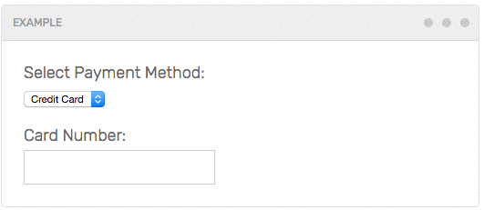

# Conditional Field
A Javascript component that shows / hides DOM elements based on form values.

Examples and docs: [https://stevenwanderski.github.io/conditional-field](https://stevenwanderski.github.io/conditional-field)



## Installation
This plugin requires jQuery. In the HTML page, first include `jQuery`, then `Conditional Field`.
Be sure to place the `<script>` tags just before the closing `<body>` tag. Examples:

### Using Bower
Run `bower install --save conditional-field`. Then load `jQuery` and `ConditionalField` on the HTML page:
```html
<script src="/bower_components/jquery/dist/jquery.min.js"></script>
<script src="/bower_components/conditional-field/dist/conditional.min.js"></script>
```

### Using NPM
Run `npm install --save conditional-field`. Then load `jQuery` and `ConditionalField` on the HTML page:
```html
<script src="/node_modules/jquery/dist/jquery.min.js"></script>
<script src="/node_modules/conditional-field/dist/conditional.min.js"></script>
```

### From local file directory
Download `dist/conditional-field.min.js` and place it in your project directory. Then load `jQuery` and `ConditionField` on the HTML page:
```html
<script src="/path/to/jquery.min.js"></script>
<script src="/path/to/conditional-field.min.js"></script>
```

## Usage

### Select

HTML:
```html
<select class="select-field">
  <option value="mothers">Mothers of Invention</option>
  <option value="spiders">Spiders from Mars</option>
</select>
<div class="zappa">Frank Zappa</div>
<div class="bowie">David Bowie</div>
```

Javascript:
```javascript
new ConditionalField({
  control: '.select-field',
  visibility: {
    'mothers': '.zappa',
    'spiders': '.bowie'
  }
});
```

### Radio buttons
HTML:
```html
<label>
  <input type="radio" name="artists" value="mothers" checked> Mothers of Invention
</label>
<label>
  <input type="radio" name="artists" value="spiders"> Spiders from Mars
</label>

<div class="zappa">Frank Zappa</div>
<div class="bowie">David Bowie</div>
```

Javascript:
```javascript
new ConditionalField({
  control: '[name="artists"]',
  visibility: {
    'mothers': '.zappa',
    'spiders': '.bowie'
  }
});
```

### Checkbox
HTML:
```html
<label>
  <input type="checkbox" class="spiders-checkbox"> Show the Spiders
</label>

<div class="zappa">Frank Zappa</div>
<div class="bowie">David Bowie</div>
```

Javascript:
```javascript
new ConditionalField({
  control: '.spiders-checkbox',
  visibility: {
    'off': '.zappa',
    'on': '.bowie'
  }
});
```

## Arguments
* `control`
    - string (query selector)
    - the form control that visibility is based on
* `visibility`
    - JSON object
    - for each `key` and `value`, when the `control` has a value of `key`, the DOM element with the selector of `value` will be shown, conversely the other `key`s will be hidden.

## Methods

### `destroy`
Removes the event listeners. Example:

```javascript
cf = new ConditionalField({
  control: '.spiders-checkbox',
  visibility: {
    'off': '.zappa',
    'on': '.bowie'
  }
});

cf.destroy();
```

## Tests

The test suite is built using Mocha and Chai. Download / clone the project locally and run a local web server (my fave: [local-web-server](https://www.npmjs.com/package/local-web-server)). Then navigate to `http://localhost:8080/test`. The localhost port will need to change based on local setup.

## Development

* Download / clone the project locally
* Run `npm install`
* Run `gulp`

---

Coded with &#9829; in Chicago by Steven Wanderski